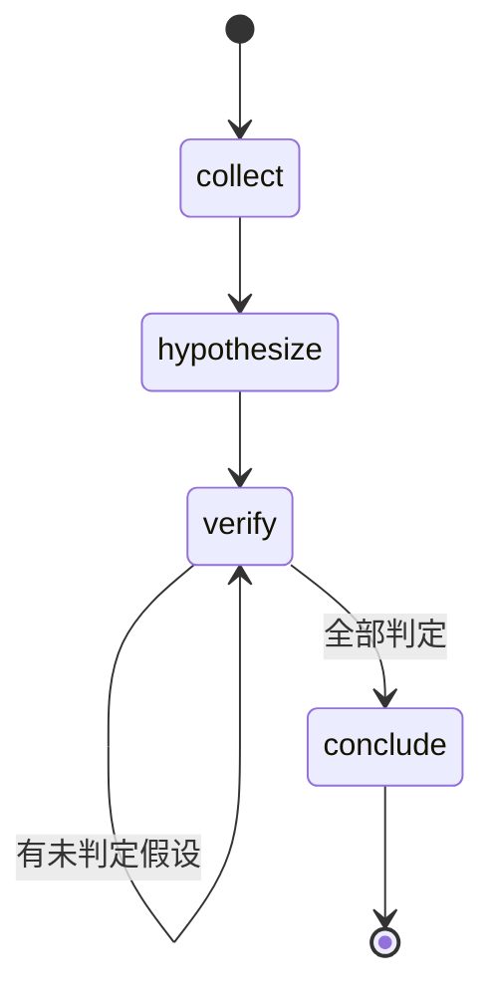

# 一、成品规格（specs）

## 目录

1. 状态机
2. 判定规则（可机器校验）
3. 新方法论
4. 新坑（含验证方法）
5. 可复用模板

| 部件 | 路径 | 作用 |
|------|------|------|
| 状态文件 | `templates/task.md` | 顶部钉引导指令；假设块含验证方法/预期证据 |
| 引导脚本 | `scripts/flow_guide.py` | 推断阶段 + 输出引导；`--check` 做门禁（退出码 0/1） |
| 门禁 hook | `.codebuddy/hooks/diagnosis-gate.js` | PreToolUse 拦规划期写代码；Stop 检查结论合规性 |
| 知识文档 | `references/*.md` | 领域知识（内部查询工具等），与本次硬化无关 |

## 状态机

| 状态 | 进入条件 | 产出 | 判定标准 | 下一步 |
|------|---------|------|---------|--------|
| `collect` | 无 | 问题事实（现象/时间窗/环境/ID） | 「问题事实」节有实质内容（非占位行） | hypothesize |
| `hypothesize` | 有事实 | 假设表（含验证方法+预期证据） | 至少 1 条假设 | verify |
| `verify` | 有假设 | 每条假设的状态 + 证据 | 标 🟢/🔴 者证据含可复查出处 | 全部判定→conclude；否则留 verify |
| `conclude` | 全部判定 | 结论（证据链+排除项） | 结论引用已证实的假设 ID | done |
| `done` | 有结论 | — | — | 归档判断 |

## 判定规则（可机器校验）

1. 标 🟢/🔴 的假设，证据段须含：`文件:行号` / `[索引集+时间窗]` / `trace_id` / 代码块 之一
2. 已判定的假设须有「验证方法」+「预期证据」（事先写死）
3. 有结论但无 🟢 支撑 → 失败
4. 仍有 🟡 未收敛假设却已写结论 → 失败

# 二、决策记录（changes）

| 决策 | 选择 | 理由 | 备选 |
|------|------|------|------|
| 是否拆状态 | 拆 5 个 | 流程有循环（验证失败回退）、跨会话、步骤 ≥4 | 单文件（长任务会跑偏） |
| 是否要引导脚本 | 要 | 判定标准复杂（证据出处格式），AI 长任务会忘 | 写进 SKILL.md（会沉底） |
| 是否要 hook | 要 | 存在**负面约束**（规划期禁止改代码），提醒无效 | 只提醒（AI 会做） |
| Stop 用提醒还是阻断 | 默认 `systemMessage` | 阻断要付一轮 LLM 调用 + 循环风险 | `continue:false`（按需升级） |

# 三、增量收获（delta）

## 新方法论

1. **hook 的条件判断而非动态插拔**：hook 常挂，脚本内读状态文件按阶段判断。配置层 matcher 只能匹配工具名，业务判断必须在脚本里。
2. **引导钉在状态文件顶部**：AI 会反复读状态文件，"记得调脚本"会沉底，但"文件第一行写着先跑引导脚本"挂在必经之路上。
3. **门禁的判定标准必须能机器校验**：写不出检查代码的标准，hook 就拦不住。

## 新坑（含验证方法）

| 坑 | 验证方法 | 后果 |
|---|---------|------|
| 工具名想当然（用了 IDE 的 `write_to_file`） | `grep -c 'write_to_file' codebuddy.js` → 0 | hook 全部静默放过，以为在工作 |
| matcher 无锚点（`Edit` 匹配 `NotebookEdit`） | 源码 `matchesTool` 用 `new RegExp().test()` | 误触发无关工具 |
| 用已废弃的 `decision: "block"` | 官方文档三处标注废弃 | 返回值被忽略，门禁失效 |
| 解析器只扫标题式假设 | 造一个表格式假设的样本跑一遍 | 漏判（真实案例首次跑就返回空） |

## 可复用模板

- `scripts/flow_guide.py` 的**宽松解析 + 缺口检测**结构可直接复用
- `hooks/diagnosis-gate.js` 的**两层过滤 + fail-open** 结构可直接复用
- `templates/task.md` 的**顶部引导指令块**格式可复用

# 四、验证记录

| 层 | 验证内容 | 结果 |
|---|---------|------|
| L1 | `flow_guide.py` 在真实 task.md 上跑通，返回正确的 `next` | ✅ |
| L2 | 合规样本（真实案例）`--check` 通过，退出码 0 | ✅ |
| L3 | 违规样本（🟢 无出处）被拦，退出码 1 | ✅ |
| L4 | PreToolUse：规划期写代码 deny / 写 task.md 放行 / Bash 跳过 | ✅ |
| L4 | Stop：报出"仍有 2 条假设未收敛却已写结论" | ✅ |

**L3 的违规样本构造方法**（可复用）：手工写一份"标 🟢 但证据段只有主观描述、且结论引用了不存在的假设 ID"的 task.md，跑 `--check` 看是否拦截。
