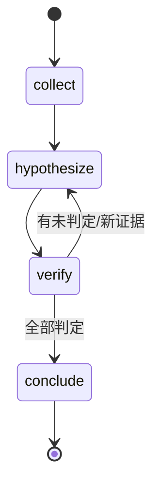

# 状态拆解方法论

Stage 1 复杂度评估 与 Stage 2 状态机设计 的详细依据。

## 一、什么算一个"状态"

状态 = **一个可判定的中间态**，满足三条：

1. **有语义**：描述"现在处于什么处境"，不是"执行到第几步"
   - ✅ `verify`（有待判定的假设）
   - ❌ `step3`（编号没有信息量）
2. **可判定**：能从产物推断出来（读文件就能算）
3. **有出口**：要么完成进下一状态，要么失败退回

**反例**：`开始`、`处理中`、`结束` 这类占位名，它们无法区分处境，也无法写出判定条件。

## 二、拆几个状态合适

| 工作流特征 | 状态数 | 说明 |
|-----------|--------|------|
| ≤3 步且线性 | **不拆** | 直接写 SKILL.md，不要状态机 |
| 4~7 步，有分支 | 4~6 个 | 典型区间 |
| 有循环（验证失败回退） | 循环 = 两个状态的来回 | 不需要额外状态 |
| ≥10 个状态 | 拆成两个 skill | 状态太多说明粒度太细 |

**判断粒度的标准**：一个状态的工作量应该是"一次会话内能完成"或"一个明确的产出"。

太细（每个小动作一个状态）会导致状态爆炸；太粗（整个流程一个状态）等于没有状态机。

## 三、五要素定义表

每个状态必须定义五件事，缺一不可：

| 要素 | 说明 | 反例 |
|------|------|------|
| **状态名** | 语义化、英文小写或中文 | `step2` |
| **进入条件** | 什么情况下算进入（可判定） | "用户说开始了" |
| **产出** | 结束时必须落盘什么 | "想清楚了" |
| **判定标准** | **可机器校验**的完成条件 | "质量合格" |
| **下一步** | 完成后流向哪（含分支） | "继续" |

### 判定标准怎么写

这是最关键的一条。**写不出检查代码的判定标准，hook 就拦不住。**

| 好的判定标准 | 差的判定标准 |
|-------------|-------------|
| "标 🟢 的假设其证据段含出处标记" | "证据充分" |
| "tasks.md 所有 checkbox 已勾选" | "任务完成" |
| "结论段落引用了至少一条已证实的假设 ID" | "结论有依据" |
| "字段非空且格式为 文件:行号" | "信息完整" |

**自检方法**：拿这个标准去问"能不能写一个 10 行的检查脚本？" 答不上来就是太虚。

## 四、循环怎么处理

长任务的常态是循环：验证失败回到假设，重开一轮。

**不要试图用 DAG 表达循环**（那是 openspec 的局限）。状态机天然支持：



关键设计：
- 循环的**出口条件**要写清（"全部判定" vs "还有未判定的"）
- 旧轮次**不删除**（标记为已排除 + 写明依据），这是防"重复猜测"的关键
- 循环不能无限（要有"证据不足则标记待补证并收口"的兜底）

## 五、常见错误

| 错误 | 后果 | 修正 |
|------|------|------|
| 状态名用编号 | 无法从产物推断处境 | 改成语义名 |
| 判定标准写成主观描述 | hook 无法校验，形同虚设 | 改成可写代码的检查 |
| 状态太多（>10） | 维护成本高，AI 也记不住 | 合并或拆成两个 skill |
| 不允许循环 | 失败后无路可走，AI 会硬编结论 | 显式定义回退路径 |
| 状态文件只有状态名 | 跨会话无法恢复现场 | 每状态带"产出 + 判定标准" |

## 六、产出模板

```markdown
| 状态 | 进入条件 | 产出 | 判定标准 | 下一步 |
|------|---------|------|---------|--------|
| collect | 无 | 事实清单（现象/时间窗/ID） | 三个字段均非空 | hypothesize |
| hypothesize | 有事实清单 | 假设表（含验证方法+预期证据） | 每条假设都有验证方法 | verify |
| verify | 有假设表 | 每条假设的状态 + 证据 | 标 🟢/🔴 者证据含出处 | 全部判定→conclude；否则留 verify |
| conclude | 全部假设已判定 | 结论（含证据链+排除项） | 结论引用已证实的假设 ID | 完成 |
```
